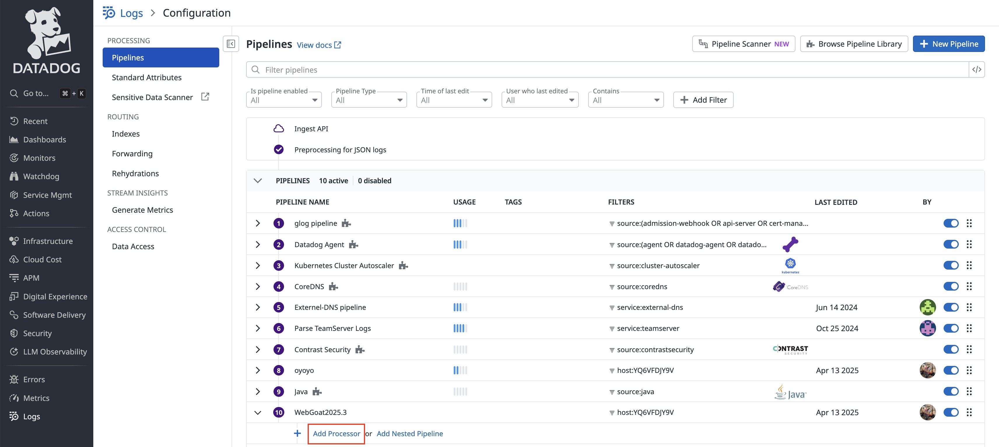
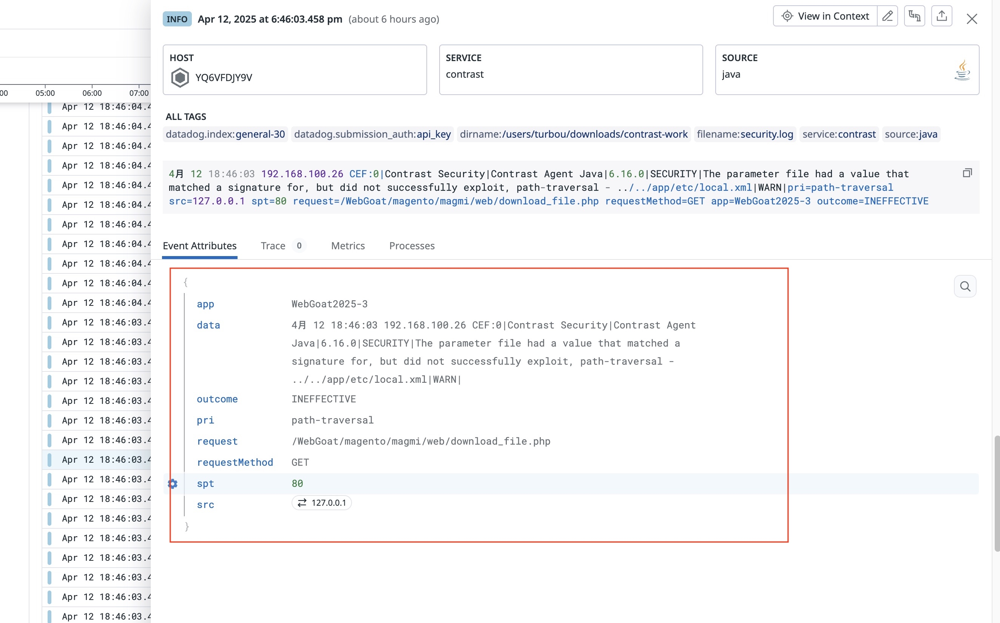
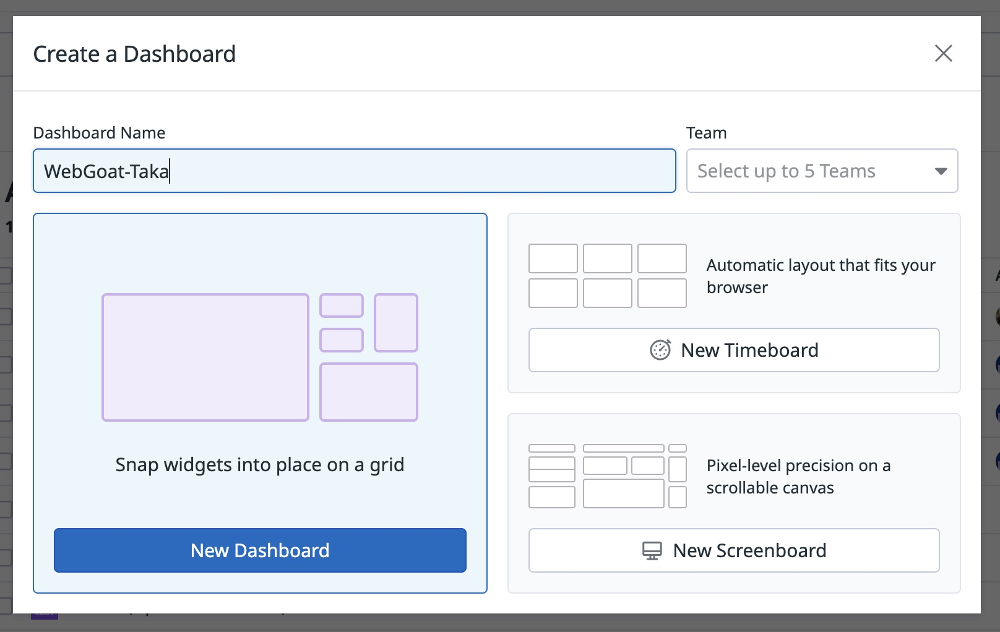
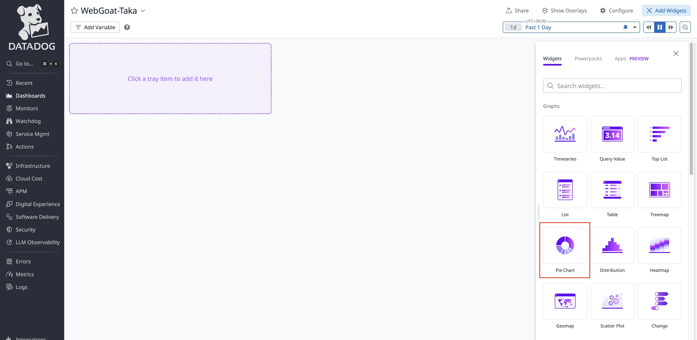

# ContrastエージェントのログをDataDogで円グラフ出すまで

## 前提条件
- コントラストのProtectライセンスを持っていること
- DataDogにアカウントがあり、Logエクスプローラー、パイプラインやダッシュボードを作成する権限を持っていること
- DataDogエージェントのインストールも済んでいること

## 使用するアプリケーション
- やられアプリ  
  WebGoat v2025.3  
  https://github.com/webgoat/webgoat/releases  
  webgoat-2025.3.jar をダウンロード

- 攻撃テストアプリ  
  Nikto  
  https://github.com/sullo/nikto

## 事前準備
### DataDogエージェント
```bash
vim ~/.datadog-agent/datadog.yaml
```
```yaml
logs_enabled: true
```
```bash
mkdir -p ~/.datadog-agent/conf.d/java.d
vim conf.yaml
```
```yaml
logs:
  - type: file
    path: /Users/turbou/Downloads/contrast-work/security.log
    service: contrast
    source: java
```
pathの値はContrastエージェントログの出力先に合わせて変更してください。  
念のため、DataDogメニューから Open Web UI で設定が反映されていることを確認してください。

## WebGoatの起動
### JavaエージェントのDL
適当な場所にダウンロードしてください。
### startup_webgoat.shの書き換え
- CONTRAST__API__TOKENの値を設定してください。
- Javaエージェントのパスを設定してください。
- contrast.agent.contrast_working_dirのフォルダ名またはパスを設定してください。
- webgoatのjarのパスを設定してください。
### WebGoatを起動する
```bash
./startup_webgoat.sh
```
### 起動とオンボード確認
- http://localhost:8080/WebGoat に接続して確認
- TeamServerにアプリとサーバがオンボードされていることを確認
  Protectのライセンスが付与されていることも確認
- security.logが指定の場所に出力されていることも確認

## DataDogのログ収集の準備
### まずはログが流れているかを確認
Logs - Explorer で以下のような感じで確認


対象のログを出すには
- スクリーンショットのようにホストで絞り込む
- 上のほうの期間を1dとかにしてみる
などしてみてください。

### パイプラインを作る
Logs - Pipelines で以下のような感じで作成


作ったパイプラインにプロセッサーを追加する。


スクリーンショットの感じでプロセッサーを作成する。

- typeは Grok Processor
- nameは任意。ここではProtectにしています。
- Log Samplesは以下を貼り付け
  ```
  4 12 11:29:51 192.168.100.26 CEF:0|Contrast Security|Contrast Agent Java|6.16.0|SECURITY|The parameter lastName had a value that successfully exploited sql-injection - D' OR '1%'\='1|WARN|pri=sql-injection src=0:zero:0:zero:0:zero:0:1 spt=8001 request=/owners requestMethod=GET app=PetClinic_8001 outcome=EXPLOITED
  ```
- parsing ruleは以下を貼り付け
  ```
  ContrastSecurityProtectLogRule %{data:data}pri=%{data:pri} src=%{ip:src} spt=%{number:spt} request=%{data:request} requestMethod=%{word:requestMethod} app=%{data:app} outcome=%{word:outcome}
  ```
  Log Samplesのところで MATCH とならない場合は、parsing ruleの末尾に改行を入れたり消したりでうまくいきます。

作ったパイプラインのとおりにログが構造化されてるかは以下のとおり


適当なログをクリックすると、構造化されているかが確認できます。


### ダッシュボードにパイチャートを作る

ダッシュボード名は適当な名前を入れて作成します。

ダッシュボードができたら、ウィジェットを追加でパイチャートを選択します。

JSONを貼り付けるところに、[結果用json](./円グラフ/Result.json) の内容ですべて書き換える。

同じような手順でパイチャートを作成し、JSONのところに、[ルール用json](./円グラフ/Pri.json) を貼り付けると、検知ルールのパイチャートウィジェットが作成できます。

以上

