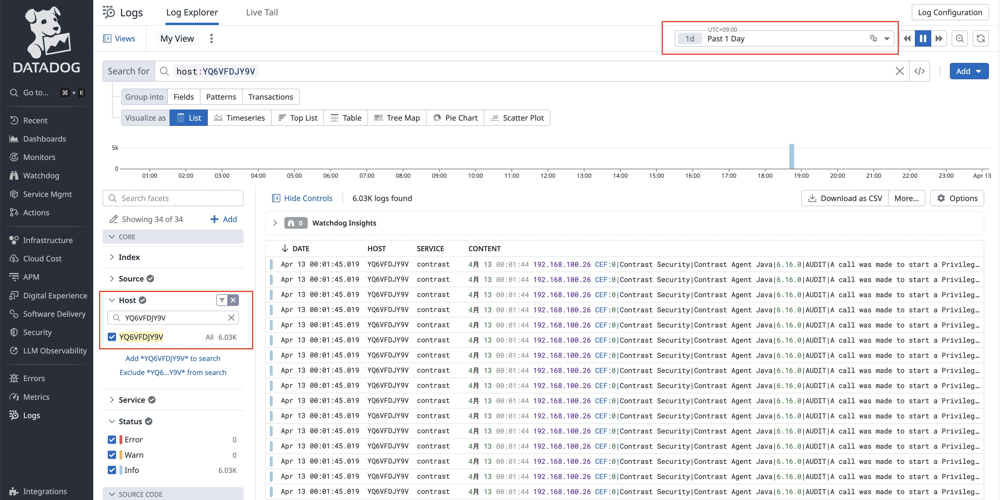
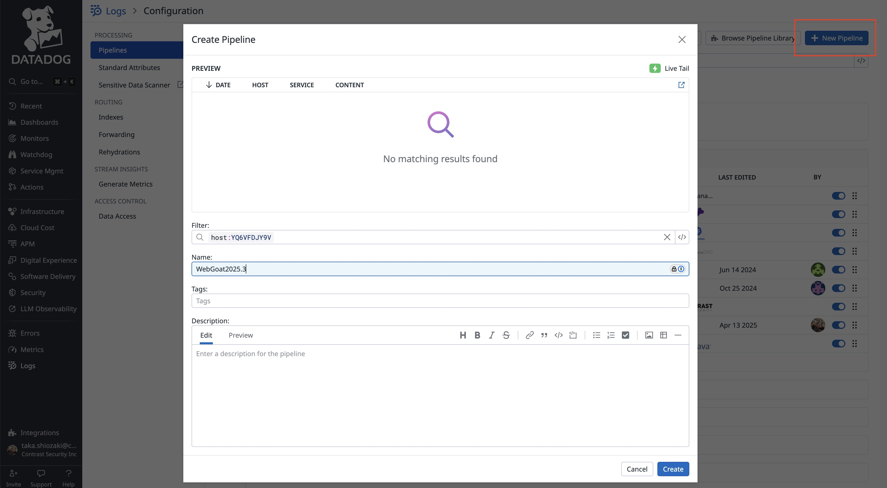

# ContrastエージェントのログをDataDogで円グラフ出すまで

## 前提条件
- コントラストのProtectライセンスを持っていること
- DataDogにアカウントがあり、Logエクスプローラー、パイプラインやダッシュボードを作成する権限を持っていること
- DataDogエージェントのインストールも済んでいること

## 使用するアプリケーション
- やられアプリ  
  WebGoat v2025.3  
  https://github.com/webgoat/webgoat/releases  
  webgoat-2025.3.jar をダウンロード

- 攻撃テストアプリ  
  Nikto  
  https://github.com/sullo/nikto

## 事前準備
### DataDogエージェント
```bash
vim ~/.datadog-agent/datadog.yaml
```
```yaml
logs_enabled: true
```
```bash
mkdir -p ~/.datadog-agent/conf.d/java.d
vim conf.yaml
```
```yaml
logs:
  - type: file
    path: /Users/turbou/Downloads/contrast-work/security.log
    service: contrast
    source: java
```
pathの値はContrastエージェントログの出力先に合わせて変更してください。  
念のため、DataDogメニューから Open Web UI で設定が反映されていることを確認してください。

## WebGoatの起動
### JavaエージェントのDL
適当な場所にダウンロードしてください。
### startup_webgoat.shの書き換え
- CONTRAST__API__TOKENの値を設定してください。
- Javaエージェントのパスを設定してください。
- contrast.agent.contrast_working_dirのフォルダ名またはパスを設定してください。
- webgoatのjarのパスを設定してください。
### WebGoatを起動する
```bash
./startup_webgoat.sh
```
### 起動とオンボード確認
- http://localhost:8080/WebGoat に接続して確認
- TeamServerにアプリとサーバがオンボードされていることを確認
  Protectのライセンスが付与されていることも確認
- security.logが指定の場所に出力されていることも確認

## DataDogのログ収集の準備
### まずはログが流れているかを確認
Logs - Explorer で以下のような感じで確認


対象のログを出すには
- スクリーンショットのようにホストで絞り込む
- 上のほうの期間を1dとかにしてみる
などしてみてください。

### パイプラインを作る
Logs - Pipelines で以下のような感じで作成


